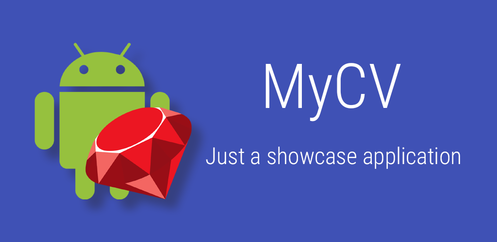

MyCV
====

MyCV is an Android demo application which have several purposes:

* it is a sandbox for me to test stuff like new libraries, new APIs or any Android
* it is a small glimpse of my current Android dev skills
* it is also my CV!

Download
----

### Google Play Store
The app can be found [on the Google Play Store on this URL](https://play.google.com/store/apps/details?id=net.fabricemk.android.mycv)

### Build from sources
You can build the project from the sources of this repository. All release versions are tagged.
The entire source tree should be compatible with Android Studio 1.3+

More about the application
---

This application is another way to show my own CV. As it is also a playground I put different stuff in it even if it was not mandatory.

### What's inside

#### Overview

* Built with Android Studio and gradle system
* Mixed usage of Activities and Fragments
* Supports device orientation changes
* Compatible with API level 14+ (Android 4.0 Ice Cream Sandwich)
* Material Design
* Avoid unnecessary permissions when possible by using Intents when possible, the only permissions required are INTERNET_CONNECTION and WRITE_EXTERNAL_STORAGE. The latest is a requirement for the Google Maps API for caching tiles on external storage but the app in itself won't use the external storage or read/write in the media folders
* Works mainly offline without internet connection (but some parts of the app may have a better experience when connected)

#### Usage of different Google Support Libraries like Design Support Library and AppCompat

* Usage of NavigationView
* All the lists are using the RecyclerView
* Nearly all the screens make usage of the Toolbar with different appearances.
    * Classic Toolbar
    * Auto-hide Toolbar when the content scrolls
    * Collapsible Toolbar with hero image when the content scrolls
* Usage of ViewPager with and without Tabs indicator

#### Usage of popular third-party libraries

* [Glide](https://github.com/bumptech/glide) for the Image loading and caching
* [Google Volley](https://android.googlesource.com/platform/frameworks/volley) for fast, efficient networking
* [Google Gson](https://github.com/google/gson) for JSON/POJO mappping

#### Android Wear Companion app

A small companion app has also been developed. It's very simple and should work on square and round screens.

#### Google Maps API

One of the screen in the application use the Google Maps API to display a MapView. If you build the app from the sources, you need to enter your own Google Maps API Key in the android/src/main/res/values/credentials.xml with the 'google_maps_api_key' key

#### Testing

Currently, two kinds of tests are implemented:
* Unit Testing with [JUnit 4](http://junit.org/) for the testing of model objects. Will also use Mockito later to test some simple Android functions
* Instrumentation tests with the [Espresso framework](https://code.google.com/p/android-test-kit/wiki/Espresso)

For now only simple tests are present but more will come soon

### What's is lacking now and could make an appearance later

* An AppEngine backend can be found in the project but it is not used for now
* Optimized layouts for tablets
* Usage of the database with an ORM like [SugarCRM](http://satyan.github.io/sugar/)
* Usage of View injection library like [Butterknife](https://github.com/JakeWharton/butterknife)
* Implement a Preference screen
* Implement Lollipop transitions animations
* More complex testing

